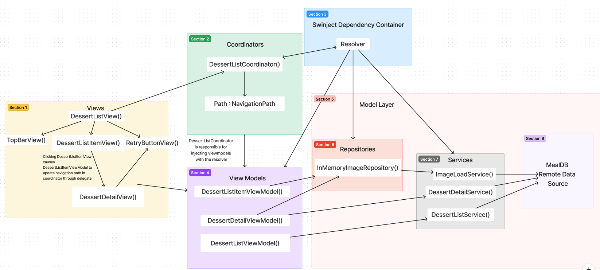

## Fetch Coding Challenge

## Summary
This coding challenge repo has 5 views: DessertMainView, DessertListView, DessertListItemView, DessertDetailView, TopBarView. Each of these views (except DessertMainView) has a viewModel. When neccessary, some ViewModels are passed to different views so that the differing view can control the display of data on the viewModel's view. The ViewModels that make network requests are DessertListView, DessertListItemView, and DessertDetailView. If the network request didn't go through, both DessertListView and DessertDetailView will show an error message and allow the user to retry the network request with a button. DessertListItemView makes a network request to load the image with the thumbnail, if its image loading request doesnt go through, it will be stuck on a progress view. DessertDetailViewModel makes the network request and has a custom decoder for the JSON to get the right data into the view model. I chose to write a custom decoder because the JSON had varying keys like "strIngredient13", etc. DessertListViewModel makes the network request using Combine and a default JSONDecoder to do the decoding which is easier and looks more sleek. Overall, I really enjoyed tackling the coding challenge and working with MVVM architecture in Swift. Thank you for the opportunity—it was a rewarding experience!

## System Architecture

