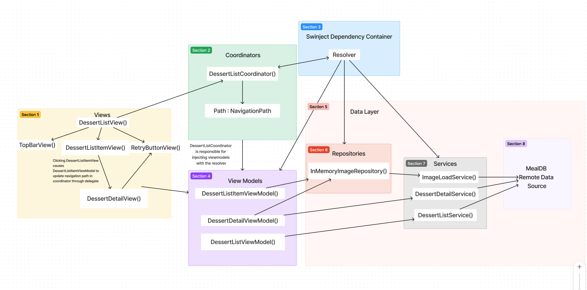

## Dessert Recipe Viewer

## Summary
In this coding challenge, I used Swinject for dependency injection and Combine for asynchronous sections. Swinject instantiates a few objects as .container scope (singletons): all the services, the DessertListCoordinator, and the Image Repostiory. The only object with a reference to the Swinject resolver is the DessertListCoordinator: this is so the coordinator can inject the viewModels. For the most part, I followed this project's example: https://github.com/jasonjrr/MVVM.Demo.SwiftUI where the coordinator serves the purpose of injecting view models and navigation logic with the NavigationPath type path variable. The views solely present data from the view models. The view models handle presentation data. The services handle RESTful API networking with MealDB, and the in-memory image repository cache stores the images collected from the ImageLoadService.

## App Architecture Diagram
Note: arrows point in the direction of dependencies, the data flows the opposite direction for the most part

